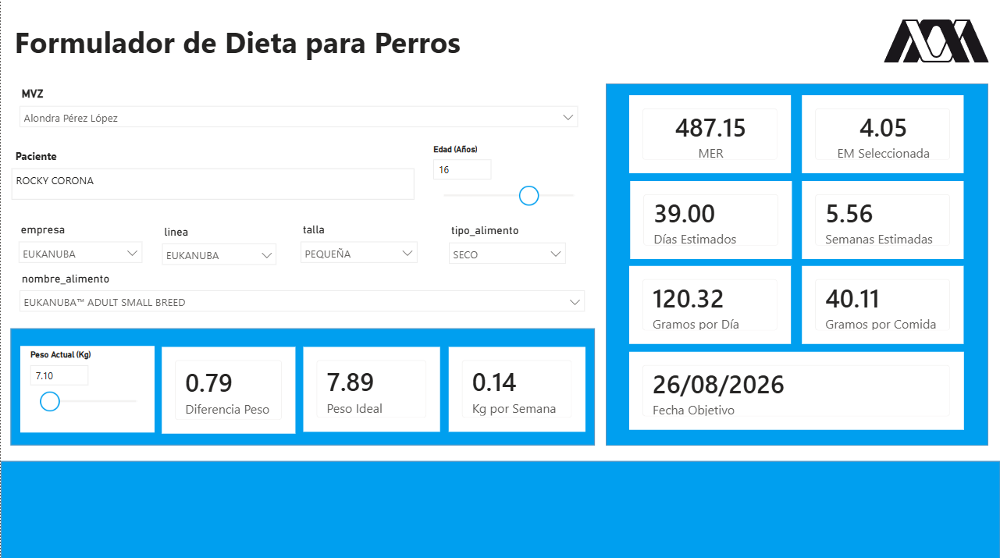
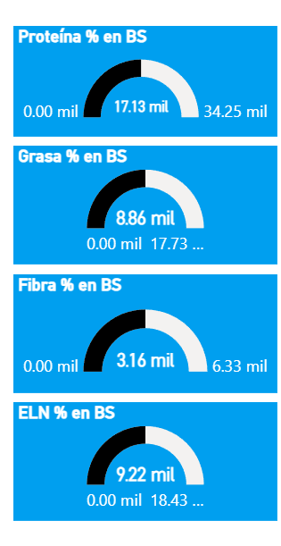

# NutriCanino

Proyecto académico de nutrición veterinaria, análisis de alimentos balanceados y manejo dietético clínico en perros, basado en evidencia científica y marcos técnicos como NRC, AAFCO, FEDIAF, WSAVA y SENASICA/SADER.

## Objetivo

Desarrollar una base de datos y una herramienta visual para organizar información nutricional de alimentos caninos, comparar su composición y relacionar los perfiles nutricionales con condiciones clínicas y recomendaciones dietéticas.

## Contenido del repositorio

### Modelo y base de datos

La carpeta [`documentacion/modelo-datos`](documentacion/modelo-datos) reúne capturas del diseño relacional, tablas de categorías y patologías, relaciones entre condiciones y recomendaciones, y la estructura empleada para administrar los datos.

### Power BI y formulador

La carpeta [`documentacion/power-bi`](documentacion/power-bi) contiene evidencia visual del tablero NutriCanino, el formulador de dietas y los indicadores de proteína, grasa, fibra y extracto libre de nitrógeno expresados en base seca.

## Vista del proyecto

## Alcance académico

Este repositorio documenta el desarrollo del proyecto y sus avances. La información nutricional y las recomendaciones dietéticas deben interpretarse dentro del contexto clínico individual y no sustituyen la valoración de un médico veterinario.

## Referencias base

- National Research Council. (2006). *Nutrient Requirements of Dogs and Cats*. National Academies Press.
- Freeman, L. M., et al. (2011). WSAVA Nutritional Assessment Guidelines. *Journal of Small Animal Practice*, 52(7), 385–396.
- FEDIAF. *Nutritional Guidelines for Complete and Complementary Pet Food for Cats and Dogs*.
