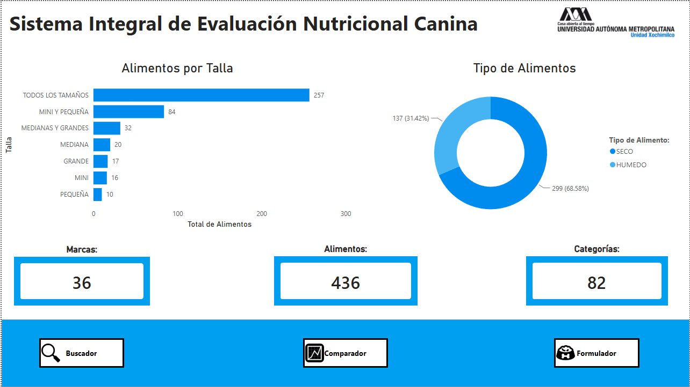
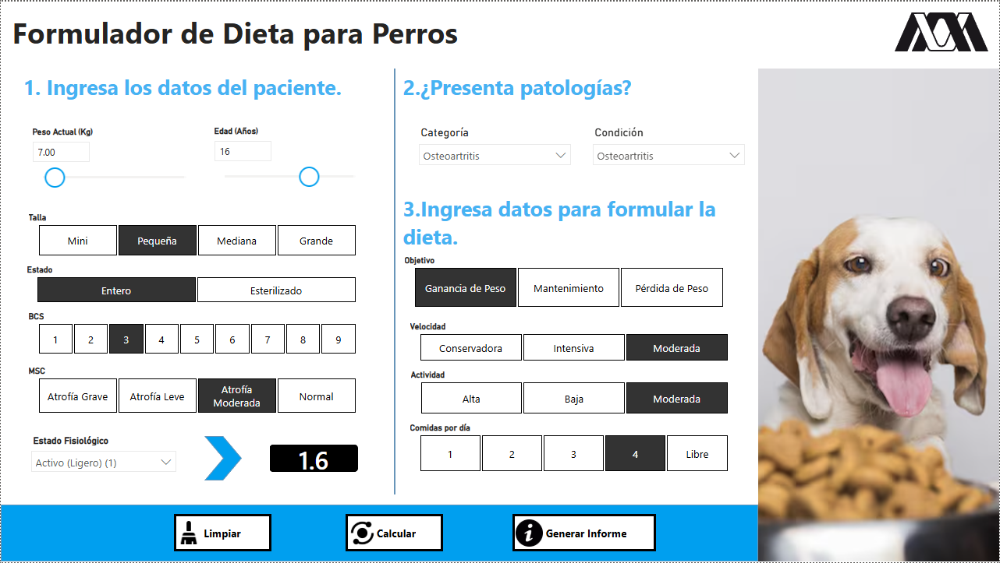
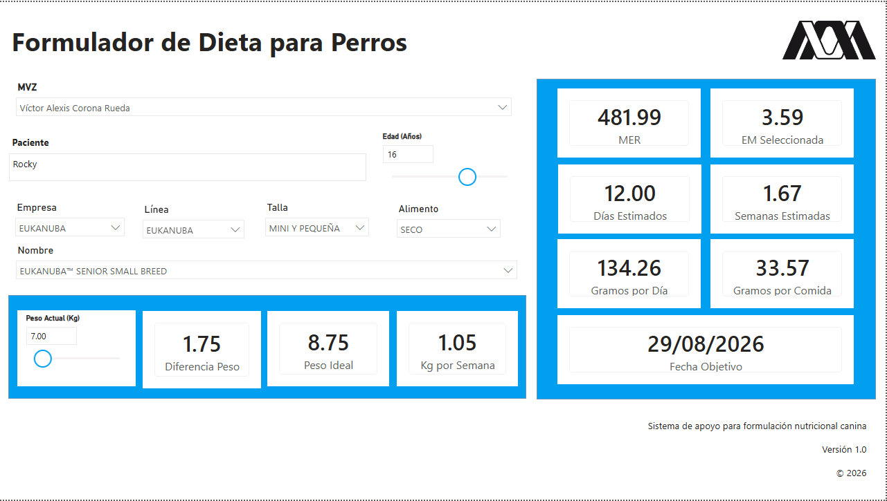
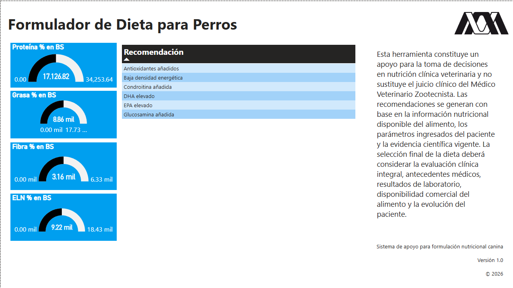
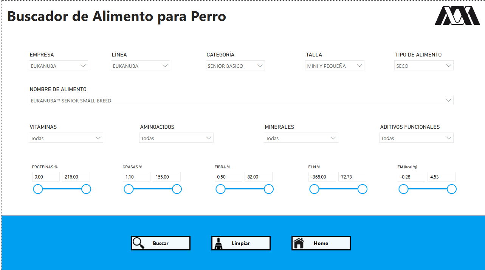
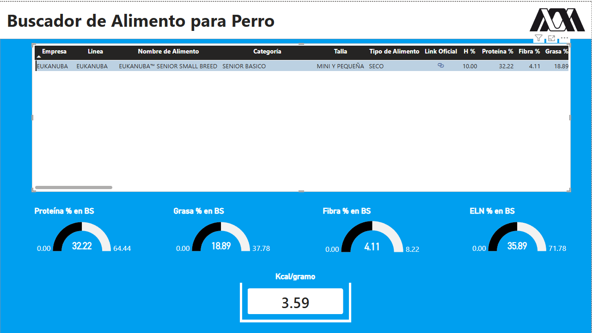
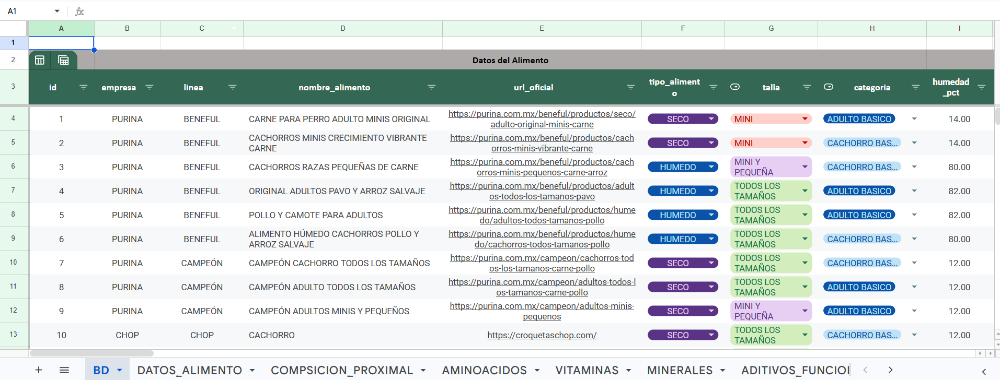
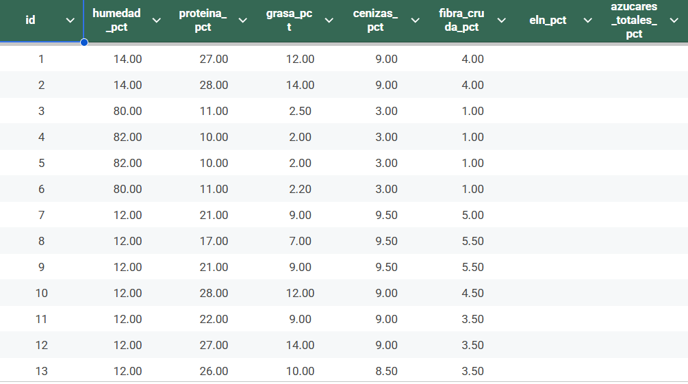
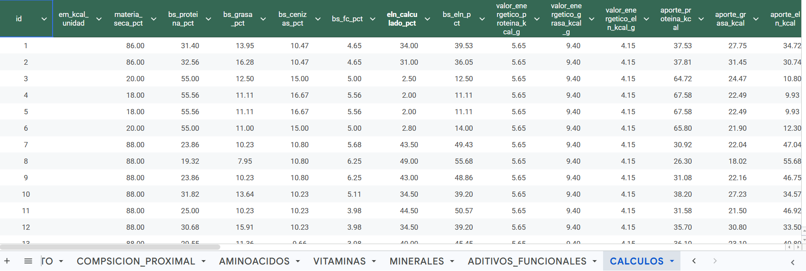

# NutriCanino

**Sistema Integral de Evaluación Nutricional Canina**

Proyecto académico orientado a la organización, consulta y análisis de información nutricional de alimentos comerciales para perros. Integra una base de datos, un buscador, un formulador dietético y herramientas visuales desarrolladas en Power BI.

## Resumen del proyecto

| Indicador | Registro |
|---|---:|
| Alimentos registrados | 436 |
| Marcas | 36 |
| Categorías | 82 |
| Tipos de alimento | Seco y húmedo |

Los datos se estructuraron para consultar alimentos por empresa, línea, categoría, talla y tipo, además de revisar composición proximal, aminoácidos, vitaminas, minerales, aditivos funcionales y cálculos nutricionales.

## Módulos documentados

### 1. Dashboard general

La [vista principal](documentacion/01-dashboard) resume la distribución de los alimentos registrados por talla y tipo, y proporciona acceso al buscador, comparador y formulador.

### 2. Formulador de dieta

El [formulador](documentacion/02-formulador) reúne:

- Datos del paciente: peso, edad, talla, estado reproductivo, condición corporal, condición muscular y estado fisiológico.
- Condición clínica o patología.
- Objetivo nutricional, velocidad del cambio de peso, actividad y comidas por día.
- Selección del alimento.
- Estimación del requerimiento energético de mantenimiento, ración diaria, porción por comida y tiempo para alcanzar el objetivo.
- Recomendaciones clínico-nutricionales asociadas.

### 3. Buscador de alimentos

El [buscador](documentacion/03-buscador) permite filtrar por empresa, línea, categoría, talla, tipo de alimento, vitaminas, aminoácidos, minerales, aditivos y rangos de nutrientes. Los resultados presentan la composición declarada y los indicadores calculados en base seca.

### 4. Modelo relacional en DBeaver

La carpeta [`documentacion/09-base-datos-dbeaver`](documentacion/09-base-datos-dbeaver) documenta las relaciones entre:

- Datos generales de los alimentos.
- Composición proximal.
- Energía y cálculos nutricionales.
- Perfil de aminoácidos.
- Vitaminas y minerales.
- Aditivos funcionales.
- Categorías, condiciones patológicas y recomendaciones.

### 5. Base de datos en Google Sheets

La carpeta [`documentacion/10-base-datos-sheets`](documentacion/10-base-datos-sheets) muestra la estructura de captura original y las hojas de datos generales, composición proximal, aminoácidos, vitaminas, minerales, aditivos funcionales y cálculos.

**[Consultar la base de datos en Google Sheets](https://docs.google.com/spreadsheets/d/1EgoIeRANVC4mVf5JOEisIt-6eFimqgvBDBw6j3tZaos/edit?usp=sharing)**

#### Criterio para datos faltantes

Las celdas vacías indican que el fabricante no proporcionó información oficial para ese alimento. Un espacio vacío **no debe interpretarse como cero ni como ausencia biológica del nutriente**; representa un dato no declarado o no disponible en la fuente oficial consultada.

## Alcance y limitaciones

NutriCanino es una herramienta de apoyo académico y técnico. Los cálculos y recomendaciones no sustituyen la valoración clínica integral, los antecedentes médicos, los resultados de laboratorio ni el criterio del Médico Veterinario Zootecnista. La composición comercial puede cambiar; por ello, debe verificarse la etiqueta y la información oficial vigente del fabricante antes de tomar decisiones clínicas.

## Referencias base

- National Research Council. (2006). *Nutrient Requirements of Dogs and Cats*. National Academies Press.
- Freeman, L. M., et al. (2011). WSAVA Nutritional Assessment Guidelines. *Journal of Small Animal Practice*, 52(7), 385–396.
- FEDIAF. *Nutritional Guidelines for Complete and Complementary Pet Food for Cats and Dogs*.
- Association of American Feed Control Officials. *Official Publication*.
